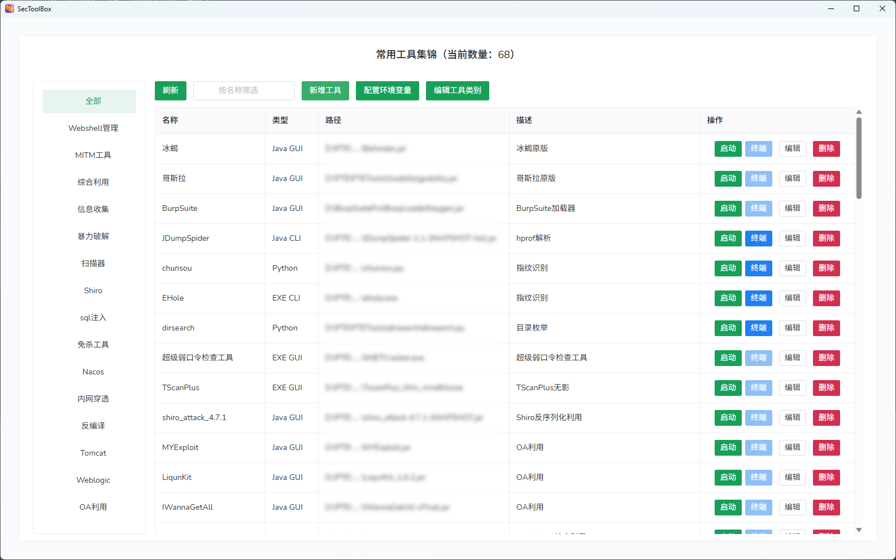
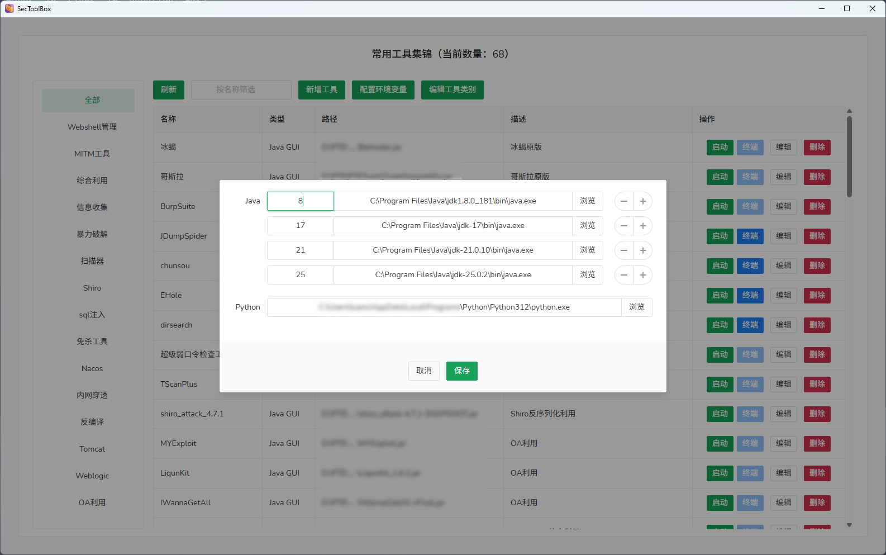
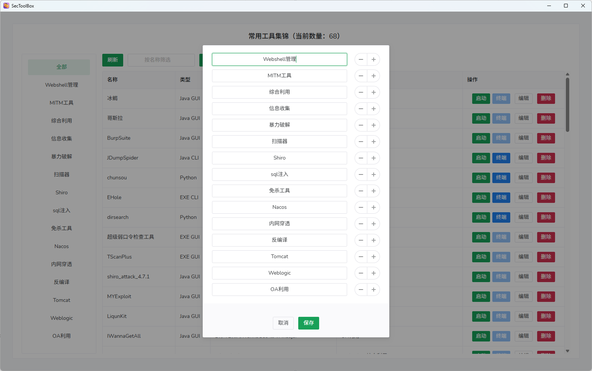

# SecToolBox

SecToolBox 是一个基于 Wails 的桌面安全工具启动器。它可以帮助你在一个本地工具箱中管理 GUI 工具、Java 工具、Python 脚本和命令行程序，并提供分类管理、环境配置以及可交互的集成 PTY 终端。


## 功能特性

- 以分类工具箱的形式管理常用安全工具。
- 支持在桌面界面中新增、编辑、删除、筛选和启动工具。
- 支持多种工具类型：
  - Java GUI：使用指定 Java 运行时启动。
  - Java CLI：在系统终端或集成终端中打开。
  - Python 工具：检测虚拟环境，并在 PTY 会话中自动配置环境。
  - EXE GUI：直接启动，支持 Windows 管理员权限提升。
  - EXE CLI：在系统终端或集成终端中打开。
- 支持配置多个 Java 运行时版本和 Python 运行时路径。
- 内置基于 xterm.js 的集成终端，后端通过 WebSocket + PTY 提供真实终端会话：
  - 支持 ANSI 颜色和光标控制。
  - 支持交互式输入输出。
  - 正确处理进度条、清屏、光标移动等终端行为。
  - 支持终端尺寸同步。
- CLI 工具可选择在系统终端或集成终端中运行。

## 截图

主界面



编辑环境变量



编辑工具类别



## 技术栈

- 后端：Go、Wails v2
- 前端：Vue 3、TypeScript、Vite、Naive UI
- 终端：xterm.js、WebSocket、Windows ConPTY、Unix-like 系统下的 `creack/pty`
- 配置持久化：YAML

## 环境要求

- Go 1.23 或更高版本
- Node.js 和 npm
- Wails CLI

如果尚未安装 Wails：

```bash
go install github.com/wailsapp/wails/v2/cmd/wails@latest
```

检查本地开发环境：

```bash
wails doctor
```

## 开发

克隆仓库：

```bash
git clone https://github.com/Gokr-ble/SecToolBox.git
cd SecToolBox
```

安装前端依赖：

```bash
cd frontend
npm install
cd ..
```

启动开发模式：

```bash
wails dev
```

该命令会同时启动 Wails 后端和 Vite 前端，并支持热更新。

## 构建

构建生产版本：

```bash
wails build
```

输出文件名由 `wails.json` 控制：

```json
{
  "name": "SecToolBox",
  "outputfilename": "SecToolBox"
}
```

## 使用方式

1. 启动 SecToolBox。
2. 添加工具分类，例如 `Web`、`Reverse`、`Exploit`、`Forensics`。
3. 添加工具信息，包括名称、类型、路径、分类和可选描述。
4. 在环境配置中设置 Java 运行时版本和 Python 路径。
5. 启动工具：
   - 点击 `启动` 可启动 GUI 工具，或将 CLI 工具打开到系统终端。
   - 点击 `终端` 可为 CLI/Python 工具启动集成 PTY 终端。

## 工具类型

| 类型 | 含义 | 行为 |
| --- | --- | --- |
| `java-gui` | Java GUI 工具 | 直接执行 `java -jar <tool>` |
| `java-cli` | Java CLI 工具 | 在终端中打开 |
| `python` | Python 工具、脚本或项目 | 在终端中打开，支持虚拟环境检测 |
| `exe-gui` | Windows GUI 可执行文件 | 直接启动可执行文件 |
| `exe-cli` | 命令行可执行文件 | 在终端中打开 |

## Python 虚拟环境

对于 Python 工具，集成终端会尝试在工具路径附近检测虚拟环境。默认检测以下常见目录名：

- `venv`
- `.venv`
- `env`
- `.env`
- `virtualenv`

选择虚拟环境后，SecToolBox 会设置：

- `VIRTUAL_ENV`
- 将虚拟环境的 `Scripts` 或 `bin` 目录放到 `PATH`/`Path` 最前面
- Windows 下的提示符前缀 `(venv)`

可以在集成终端中验证虚拟环境是否生效：

```cmd
where python
python -c "import sys;print(sys.prefix)"
```

## Java 运行时配置

Java 版本在环境配置中管理。每个 Java 配置项可以指向 Java Home 目录，也可以直接指向 `java.exe`/`java` 可执行文件。Java CLI 和 Java GUI 工具可以选择对应的运行时版本启动。

## 配置文件

SecToolBox 会在工作目录下使用 `config.yaml` 保存配置。

示例：

```yaml
version: "1.0"
categories:
  - Web
  - Reverse
tools:
  - id: "ffuf"
    name: "ffuf"
    type: "exe-cli"
    path: "D:\\PATH\\TO\\ffuf.exe"
    description: "Fast web fuzzer"
    category: "Web"
  - id: "dirsearch"
    name: "dirsearch"
    type: "python"
    path: "D:\\PATH\\TO\\dirsearch.py"
    description: "Web path scanner"
    category: "Web"
env:
  java:
    - "8": "C:\\Java\\jdk8\\bin\\java.exe"
    - "17": "C:\\Java\\jdk17\\bin\\java.exe"
  python: "C:\\Python312\\python.exe"
```

## 集成终端说明

集成终端面向真实 CLI 交互场景设计。前端使用 xterm.js，后端通过本地 WebSocket 桥接到 PTY 会话。

不同平台的行为：

- Windows：优先使用 ConPTY。
- Linux/macOS：使用 `github.com/creack/pty`。

如果某个工具在集成终端中的行为和普通终端不一致，请优先检查工具工作目录和环境变量配置是否正确。

## 项目结构

```text
.
├── app.go                  # Wails 绑定的应用方法
├── config_manager.go       # YAML 配置读写
├── main.go                 # Wails 入口
├── process_runner.go       # 系统终端和 GUI 工具启动逻辑
├── pty_terminal.go         # PTY 会话和 WebSocket 服务
├── pty_windows.go          # Windows ConPTY 实现
├── pty_unix.go             # Unix PTY 实现
├── frontend/
│   ├── src/
│   │   ├── App.vue
│   │   └── components/
│   │       ├── Main.vue
│   │       └── CliTerminal.vue
│   └── package.json
└── wails.json
```

## 安全提示

SecToolBox 会启动本地工具，并可能向子进程传递环境变量。请只添加可信路径下的工具，并在启动第三方二进制文件或脚本前检查路径和运行时配置。
